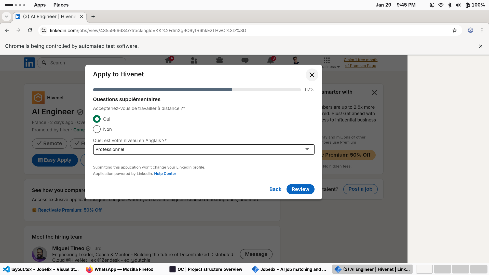

<a id="readme-top"></a>

<!-- PROJECT SHIELDS -->
<div align="center">

[![Contributors][contributors-shield]][contributors-url]
[![Forks][forks-shield]][forks-url]
[![Stargazers][stars-shield]][stars-url]
[![Issues][issues-shield]][issues-url]
[![CC BY-NC 4.0 License][license-shield]][license-url]

[![Vercel][vercel-shield]][vercel-url]
[![CI][ci-shield]][ci-url]

</div>

<!-- PROJECT LOGO -->
<br />
<div align="center">
  <a href="https://github.com/jobelix-dev/jobelix">
    
  </a>

  <h1 align="center">Jobelix</h1>

  <p align="center">
    <strong>Automate your LinkedIn job applications with AI</strong>
    <br />
    Apply to hundreds of jobs while you sleep.
    <br />
    <br />
    <a href="https://www.jobelix.fr"><strong>Visit Website »</strong></a>
    <br />
    <br />
    <a href="https://www.jobelix.fr/download">Download App</a>
    ·
    <a href="https://github.com/jobelix-dev/jobelix/issues/new?labels=bug&template=bug-report.md">Report Bug</a>
    ·
    <a href="https://github.com/jobelix-dev/jobelix/issues/new?labels=enhancement&template=feature-request.md">Request Feature</a>
  </p>
</div>

<!-- HERO IMAGE -->
<div align="center">
  
</div>

<br />

<!-- TABLE OF CONTENTS -->
<details>
  <summary>Table of Contents</summary>
  <ol>
    <li><a href="#-about-the-project">About The Project</a></li>
    <li><a href="#-features">Features</a></li>
    <li><a href="#-built-with">Built With</a></li>
    <li><a href="#-getting-started">Getting Started</a></li>
    <li><a href="#-installation">Installation</a></li>
    <li><a href="#-project-structure">Project Structure</a></li>
    <li><a href="#-contributing">Contributing</a></li>
    <li><a href="#-rewards-for-contributors">Rewards for Contributors</a></li>
    <li><a href="#-roadmap">Roadmap</a></li>
    <li><a href="#-license">License</a></li>
    <li><a href="#-contact">Contact</a></li>
  </ol>
</details>

---

## 🎯 About The Project

**Jobelix** is an open-source job application automation platform that helps job seekers apply to hundreds of LinkedIn jobs automatically using AI.

The platform consists of:
- **Web App** — Build your profile, upload your resume, manage credits
- **Desktop App** — Electron-based automation bot that applies to jobs on LinkedIn
- **AI Engine** — GPT-4o powered resume parsing and question answering

### The Problem

Applying for jobs is time-consuming and repetitive. Most job applications ask the same questions, require the same information, and follow the same patterns. Job seekers spend hours every day copy-pasting their information into forms.

### The Solution

Jobelix automates the entire process:
1. **Upload your resume** — AI extracts all your information
2. **Set your preferences** — Target roles, locations, salary expectations
3. **Start the bot** — It applies to matching jobs 24/7
4. **Track applications** — See every job you've applied to

<p align="right">(<a href="#readme-top">back to top</a>)</p>

---

## ✨ Features

| Feature | Description |
|---------|-------------|
| 🤖 **AI Resume Parsing** | GPT-4o extracts your experience, education, skills from PDF |
| 🔄 **Auto-Apply Bot** | Playwright-based bot fills forms and submits applications |
| 💬 **Smart Q&A** | AI answers screening questions based on your profile |
| 🎯 **Job Matching** | Filter by title, location, salary, company size |
| 📊 **Application Tracking** | Dashboard shows all your applications |
| 🔐 **Secure Auth** | Supabase authentication with RLS policies |
| 💳 **Credit System** | Pay-per-application with Stripe integration |
| 🖥️ **Cross-Platform** | Windows, macOS, Ubuntu, Arch Linux |

<p align="right">(<a href="#readme-top">back to top</a>)</p>

---

## 🛠️ Built With

<div align="center">

[![Next.js][Next.js]][Next-url]
[![React][React.js]][React-url]
[![TypeScript][TypeScript]][TypeScript-url]
[![Tailwind CSS][TailwindCSS]][TailwindCSS-url]
[![Supabase][Supabase]][Supabase-url]
[![Electron][Electron]][Electron-url]
[![Playwright][Playwright]][Playwright-url]
[![OpenAI][OpenAI]][OpenAI-url]
[![Stripe][Stripe]][Stripe-url]

</div>

| Layer | Technology |
|-------|------------|
| **Frontend** | Next.js 16 (App Router), React 19, Tailwind CSS 4 |
| **Backend** | Next.js API Routes, Supabase (PostgreSQL + Auth) |
| **Desktop** | Electron 39, electron-builder |
| **Bot** | Playwright (Chromium), Python runtime |
| **AI** | OpenAI GPT-4o |
| **Payments** | Stripe |
| **Deployment** | Vercel (web), GitHub Actions (desktop builds) |

<p align="right">(<a href="#readme-top">back to top</a>)</p>

---

## 🚀 Getting Started

### Prerequisites

- **Node.js** 20+ ([Download](https://nodejs.org/))
- **Docker** (for local Supabase) ([Download](https://www.docker.com/products/docker-desktop/))
- **Supabase CLI** ([Install Guide](https://supabase.com/docs/guides/cli))

### Quick Start

```bash
# Clone the repository
git clone https://github.com/jobelix-dev/jobelix.git
cd jobelix

# Install dependencies
npm install

# Set up environment variables
cp .env.example .env.local
# Edit .env.local with your keys (see Configuration section)

# Start local Supabase
supabase start

# Run the development server
npm run dev
```

Open [http://localhost:3000](http://localhost:3000) in your browser.

<p align="right">(<a href="#readme-top">back to top</a>)</p>

---

## 📦 Installation

### Download Desktop App

#### Linux (Ubuntu, Arch, Manjaro, etc.)
```bash
curl -fsSL https://jobelix.fr/install.sh | bash
```

#### Windows / macOS
Download from the [Releases Page](https://github.com/jobelix-dev/jobelix-releases/releases/latest).

---

### Configuration

Create a `.env.local` file with the following variables:

```bash
# Supabase (Required)
NEXT_PUBLIC_SUPABASE_URL=https://your-project.supabase.co
NEXT_PUBLIC_SUPABASE_ANON_KEY=your-anon-key
SUPABASE_SERVICE_ROLE_KEY=your-service-role-key

# OpenAI (Required for AI features)
OPENAI_API_KEY=sk-...

# Stripe (Required for payments)
STRIPE_SECRET_KEY=sk_test_...
STRIPE_WEBHOOK_SECRET=whsec_...
STRIPE_PRICE_CREDITS_250=price_...
STRIPE_PRICE_CREDITS_750=price_...
STRIPE_PRICE_CREDITS_1500=price_...

# GitHub OAuth (Optional)
GITHUB_CLIENT_ID=...
GITHUB_CLIENT_SECRET=...

# App URL
NEXT_PUBLIC_APP_URL=http://localhost:3000
```

See `.env.example` for all available options.

<p align="right">(<a href="#readme-top">back to top</a>)</p>

---

## 📁 Project Structure

```
jobelix/
├── app/                    # Next.js App Router
│   ├── api/               # API routes (server-side)
│   │   ├── auth/         # Authentication endpoints
│   │   ├── student/      # Student profile, resume, applications
│   │   ├── company/      # Company dashboard endpoints
│   │   └── stripe/       # Payment webhooks
│   ├── dashboard/        # Protected dashboard pages
│   ├── components/       # React components
│   └── landing/          # Public landing page
├── lib/
│   ├── client/           # Browser-only code (hooks, API calls)
│   ├── server/           # Server-only code (DB, Stripe, OpenAI)
│   └── shared/           # Shared types and schemas
├── src/main/             # Electron main process
│   └── modules/          # Window, IPC, update managers
├── supabase/
│   └── migrations/       # Database migrations (SQL)
├── scripts/              # Build and release scripts
├── resources/            # Platform-specific bot runtimes
└── build/                # Electron build assets
```

<p align="right">(<a href="#readme-top">back to top</a>)</p>

---

## 🤝 Contributing

We welcome contributions from the community! Whether you're fixing bugs, adding features, or improving documentation, your help is appreciated.

### How to Contribute

1. **Fork the Project**
2. **Create your Feature Branch**
   ```bash
   git checkout -b feature/amazing-feature
   ```
3. **Make your Changes**
4. **Run Quality Checks**
   ```bash
   npm run lint
   npx tsc --noEmit
   npm run build
   ```
5. **Commit your Changes**
   ```bash
   git commit -m 'Add amazing feature'
   ```
6. **Push to the Branch**
   ```bash
   git push origin feature/amazing-feature
   ```
7. **Open a Pull Request**

### Development Guidelines

- Read [`AGENTS.md`](AGENTS.md) for codebase conventions
- Follow existing code patterns
- Add TypeScript types for new code
- Test your changes locally before submitting

<p align="right">(<a href="#readme-top">back to top</a>)</p>

---

## 🎁 Rewards for Contributors

**We reward contributors with free Jobelix credits!**

| Contribution Type | Reward |
|-------------------|--------|
| 🐛 Bug fix (minor) | 50 credits |
| 🐛 Bug fix (major) | 150 credits |
| ✨ New feature (small) | 100 credits |
| ✨ New feature (medium) | 300 credits |
| ✨ New feature (large) | 500+ credits |
| 📚 Documentation improvement | 25-100 credits |
| 🔒 Security vulnerability report | 200-500 credits |

**How it works:**
1. Submit a PR or report an issue
2. Once merged/validated, we'll credit your Jobelix account
3. Use credits to auto-apply to jobs!

> 💡 **Note:** Create an account on [jobelix.fr](https://www.jobelix.fr) with the same email as your GitHub account to receive credits automatically.

<p align="right">(<a href="#readme-top">back to top</a>)</p>

---

## 🗺️ Roadmap

- [x] AI-powered resume parsing
- [x] LinkedIn auto-apply bot
- [x] Cross-platform desktop app
- [x] Stripe payment integration
- [x] GitHub OAuth for developer profiles
- [ ] Indeed job board support
- [ ] Chrome extension
- [ ] Mobile app (React Native)
- [ ] Company dashboard for recruiters
- [ ] Interview scheduling integration
- [ ] Multi-language support

See the [open issues](https://github.com/jobelix-dev/jobelix/issues) for a full list of proposed features and known issues.

<p align="right">(<a href="#readme-top">back to top</a>)</p>

---

## 📄 License

This project is licensed under the **Creative Commons Attribution-NonCommercial 4.0 International License** (CC BY-NC 4.0).

You are free to share and adapt this work for non-commercial purposes with attribution. See [`LICENSE`](LICENSE) for details.

[](https://creativecommons.org/licenses/by-nc/4.0/)

<p align="right">(<a href="#readme-top">back to top</a>)</p>

---

## 📧 Contact

**Jobelix Team** — [jobelix.contact@gmail.com](mailto:jobelix.contact@gmail.com)

- Website: [https://www.jobelix.fr](https://www.jobelix.fr)
- GitHub: [@jobelix-dev](https://github.com/jobelix-dev)

<p align="right">(<a href="#readme-top">back to top</a>)</p>

---

## 🙏 Acknowledgments

- [Best-README-Template](https://github.com/othneildrew/Best-README-Template)
- [Shields.io](https://shields.io)
- [Lucide Icons](https://lucide.dev)
- [Vercel](https://vercel.com) for hosting
- [Supabase](https://supabase.com) for backend infrastructure

<p align="right">(<a href="#readme-top">back to top</a>)</p>

---

<!-- MARKDOWN LINKS & IMAGES -->
[contributors-shield]: https://img.shields.io/github/contributors/jobelix-dev/jobelix.svg?style=for-the-badge
[contributors-url]: https://github.com/jobelix-dev/jobelix/graphs/contributors
[forks-shield]: https://img.shields.io/github/forks/jobelix-dev/jobelix.svg?style=for-the-badge
[forks-url]: https://github.com/jobelix-dev/jobelix/network/members
[stars-shield]: https://img.shields.io/github/stars/jobelix-dev/jobelix.svg?style=for-the-badge
[stars-url]: https://github.com/jobelix-dev/jobelix/stargazers
[issues-shield]: https://img.shields.io/github/issues/jobelix-dev/jobelix.svg?style=for-the-badge
[issues-url]: https://github.com/jobelix-dev/jobelix/issues
[license-shield]: https://img.shields.io/badge/License-CC%20BY--NC%204.0-lightgrey.svg?style=for-the-badge
[license-url]: https://creativecommons.org/licenses/by-nc/4.0/

[vercel-shield]: https://img.shields.io/badge/Vercel-Deployed-black?style=for-the-badge&logo=vercel
[vercel-url]: https://www.jobelix.fr
[ci-shield]: https://img.shields.io/github/actions/workflow/status/jobelix-dev/jobelix/release.yml?style=for-the-badge&logo=github&label=Build
[ci-url]: https://github.com/jobelix-dev/jobelix/actions/workflows/release.yml

[Next.js]: https://img.shields.io/badge/Next.js-000000?style=for-the-badge&logo=nextdotjs&logoColor=white
[Next-url]: https://nextjs.org/
[React.js]: https://img.shields.io/badge/React-20232A?style=for-the-badge&logo=react&logoColor=61DAFB
[React-url]: https://reactjs.org/
[TypeScript]: https://img.shields.io/badge/TypeScript-007ACC?style=for-the-badge&logo=typescript&logoColor=white
[TypeScript-url]: https://www.typescriptlang.org/
[TailwindCSS]: https://img.shields.io/badge/Tailwind_CSS-38B2AC?style=for-the-badge&logo=tailwind-css&logoColor=white
[TailwindCSS-url]: https://tailwindcss.com/
[Supabase]: https://img.shields.io/badge/Supabase-3ECF8E?style=for-the-badge&logo=supabase&logoColor=white
[Supabase-url]: https://supabase.com/
[Electron]: https://img.shields.io/badge/Electron-47848F?style=for-the-badge&logo=electron&logoColor=white
[Electron-url]: https://www.electronjs.org/
[Playwright]: https://img.shields.io/badge/Playwright-2EAD33?style=for-the-badge&logo=playwright&logoColor=white
[Playwright-url]: https://playwright.dev/
[OpenAI]: https://img.shields.io/badge/OpenAI-412991?style=for-the-badge&logo=openai&logoColor=white
[OpenAI-url]: https://openai.com/
[Stripe]: https://img.shields.io/badge/Stripe-626CD9?style=for-the-badge&logo=stripe&logoColor=white
[Stripe-url]: https://stripe.com/
